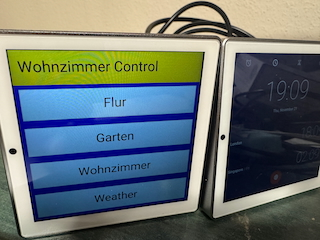
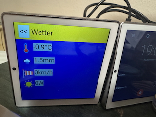

This little piece of software's purpose is to display a webview in
Kiosk mode on an Android device to serve as a "smart home" control
panel.

It's just for my own use; I doubt that it'll be too useful for others,
but since I like free software I thought I'd publish it here.

It currently has the target URL hardcoded.

It loads that URL and everything else you can do in JavaScript. The
URL is reloaded once per hour unless the display is used, in which
case the reload will be postponed to 60 seconds after the last touch.

You may query the target device's unique id from Javascript by writing a
function as such:

<pre>
function getDeviceId() {
    if (typeof alamakNative !== "undefined") {
        return alamakNative.getDeviceId();
    }
    return "virtual";
}
</pre>

Example usage:

